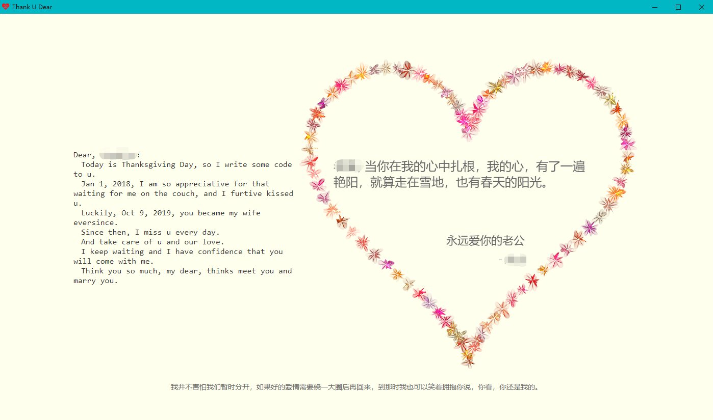

### H5表白小程序

-----

这是一个用HTML5+CSS+JS 写的表白小程序，画面非常温馨甜蜜。

#### 运行演示



#### 快速开始

1. 所有的文字都是可以在index.html，可以自定义：
```html
<dic id="code">
...
</div>
```
2. 展示给对方
- 搭建web网站
   如果条件允许情况你，你可以将这个部署到你的云机器上，Tomcat、Nginx都可以，然后把url给对方就好了，这种方式对方最为方便。

- 打包成可运行的文件
   可以借助于NW.js + Enigma Virtual Box将这个小程序打包成.exe文件，对方是window电脑的话，相对更友好。关于打包的方法可以参考：[Html打包成exe](https://blog.csdn.net/qq_35934658/article/details/86618635)

- 一键打包
   相对上面两种方法，步骤都比较繁琐，这里推荐一个[html一键打包软件](http://www.krpano.tech/archives/193)
